# Behind the Membership Door: Behavioral Insights for Retention & Growth

This project examines member behavior within a gym's median membership tenure and offers actionable strategies to retain members, reduce churn, and enhance business profitability. I partnered with a gym manager to gather data, uncover churn patterns, and design targeted interventions.

View Project Here: https://tony-gh123.github.io/Data-Wrangling-Python-SQL-Churn-Data-Analysis/  

SKILLS: Python (Numpy, Pandas), SQL, SQLite, Matplotlib, Seaborn, Storytelling, Time Series Analysis, Business Intelligence, Behavioral Analytics.   

**Table of Contents**
- [Executive Summary](#executive-summary)
- [Background](#background)
- [Database Schema](#database-schema)
- [Insights Deep Dive](#insights-deep-dive)
    - Demographics & Sales Seasonality
    - Overall Retention & Churn Analysis
    - Membership Type & Churn Analysis
    - Check-In Behavior & Usage Patterns
    - Agreement Type & Check-in Bucket
    - Class Attendance & Personal Training Impact
    - Purchase Behavior & Engagement Signals
    - Payment Timeliness & Retention
    - Cancellation Reasons & External Factors
- [Key Recommendations](#key-recommendations)
    - Maximize Agreement Opportunities for Local Members
    - Recognize Check-In Patterns to Re-Engage Members
    - Engage Members During Peak Hours
    - Address Late Payments Proactively
- [Assumptions](#assumptions)
- [Appendices](#appendices)

## Executive Summary

Right now, we see sales spikes in January, June, and August. If we don’t keep members engaged between those peaks, revenue takes a hit. At IKIGAI GYM, half of our members are leaving by the 105-day mark — that’s a clear sign we need stronger retention. The data shows three big drivers: membership type, how engaged members are, and whether they pay reliably. If we push more annual agreements, deepen engagement through classes, small purchases, personal training, and step in early when members show risk, we can extend lifecycles and keep revenue consistent.

- **Annual contracts drive stability**: Annual members churn at just 11.6–13.6%, compared to 18–25.8% for month-to-month contracts. Steering stable, local members toward annual plans reduces early cancellations.

- **Engagement protects tenure**: Members who check in at least 4 times per month churn at just 15.3%, compared to 43% for those with fewer visits. Structured activities deepen loyalty — churn falls to 17.3% for class participants, 12% for personal training clients, and just 11% for those who do both. Purchases add another layer of commitment, with buyers churning at 16.9% versus 28.3% for non-buyers.

- **Early warning signals are actionable**: Inactivity of 30+ days raises cancellation risk to 43.9%, and members who pay more than half their bills late churn at 97.5%. Automated flagging, personalized re-engagement, and proactive payment interventions are essential to recover at-risk members.

Retention hinges on aligning commitment with engagement. By promoting longer-term contracts, embedding members in structured activities, and acting quickly on payment or attendance red flags, IKIGAI GYM can meaningfully extend the average membership lifecycle and unlock steady, sustainable growth.

## Background

The fitness club **IKIGAI GYM** operates in a competitive urban market where seasonal spikes and transient population make retention critical for profitability. The club is overseen by a small corporate division responsible for staff, compliance, and financial performance.

Member retention is currently only monitored through basic churn reports, with limited visibility into member lifecycles or behavior leading up to cancellation. Experiencing only seasonal sales peaks (January, June, August) further challenges long-term growth. The corporate team is particularly interested in extending the average membership lifecycle during slower months to stabilize revenue.

### Database Schema

As a data analyst I was able to retreive the following csv files from the manager.

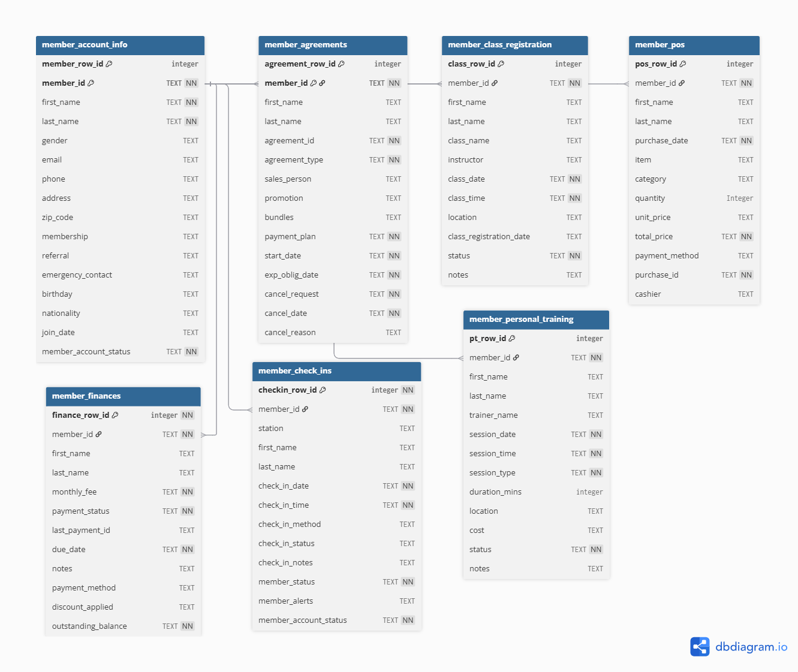

_**Disclaimer**: Synthethic IKIGAI-GYM DB_

# Insights Deep Dive 

## Member Demographics

From August 2023 to August 2025, the gym sold 1,000 memberships. Of these, 682 remain active and 318 have canceled. The member base is 59.8% male and 40.2% female, with an average age of 35 ± 9.4 years.

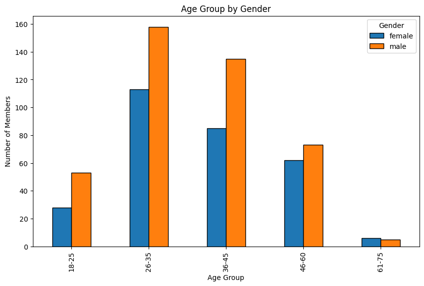

## Sales Seasonality

We observe an initial sales peak at the beginning of the year, followed by slower months towards June, a pick-up during the summer with seasonal peaks (June & August), and decreases during winter.

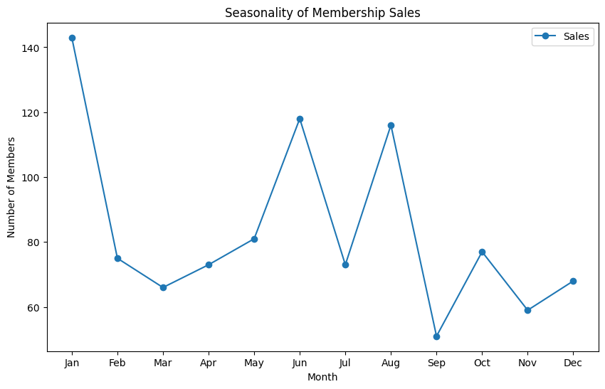

## Overall Churn Analysis

Understanding the overall churn is essential because it shows when members are most at risk of leaving and how quickly attrition accumulates over time. This highlights the critical windows where targeted interventions can have the greatest impact.

- **Day 30**: About 21% of members cancel within their first month, making this a critical “trial period” where onboarding engagement matter most.

- **Day 60**: Churn rises to ~35%, often reflecting members who haven’t built consistent habits or connections.

- **Day 90**: Nearly 44% have canceled, confirming the first three months as a decisive window for long-term retention.

- **Day 120**: More than half (56%) have left. Beyond this point, sustained retention depends on re-engaging those at risk.

The median tenure is just 105 days (3.5 months), meaning half of all members leave within the first four months.
 

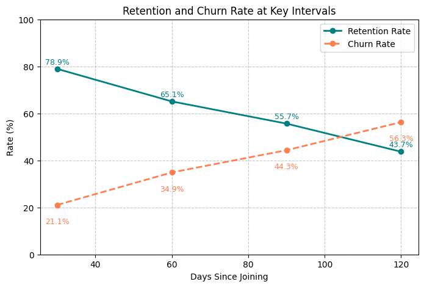
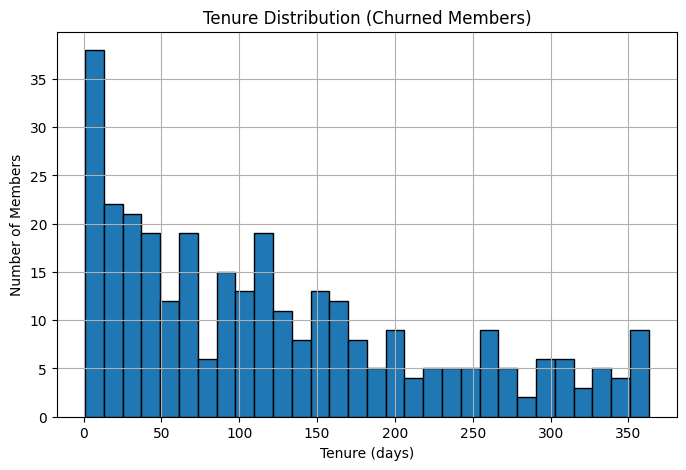

## Membership Type & Churn Analysis

Membership type is a strong predictor of retention because it reflects the initial commitment made by the buyer. Members who commit to annual plans are signaling longer-term intent, while those on month-to-month contracts keep their options open. By comparing the two, we can see which agreements are most effective at holding members beyond the critical 105-day benchmark.

- **Annual memberships are most stable**: Standard Annual members show the lowest churn rate at 15.5%, followed closely by Passport Annual at 18.2% (with only 11.56% and 13.64% canceling within the 105-day window). These members are less likely to drop out early, suggesting that longer commitments create stronger incentives to stay.

- **Month-to-month memberships are riskier**: Standard M2M members churn at 36.4%, while Passport M2M members are the most likely to leave, with churn over 41.9% (18% and 25.83% respectively within the 105-day window). The flexibility of these plans attracts new members, but also makes it easier to cancel when motivation dips.
 

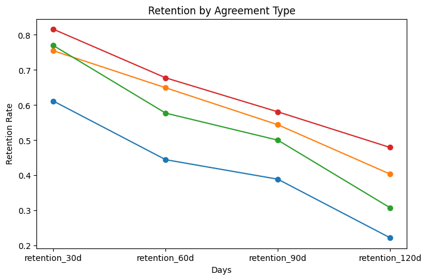
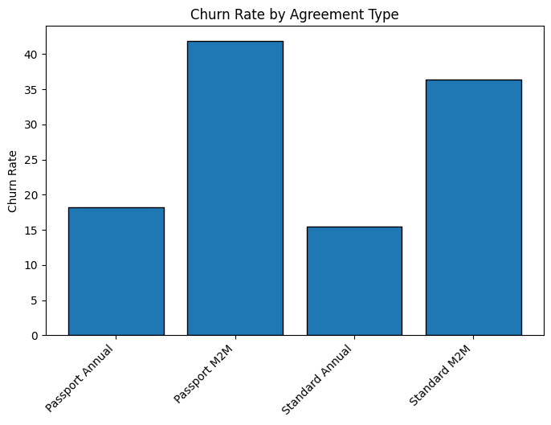

## Check-In Behavior & Usage Patterns

Check-ins are the most fundamental signal of a member's engagement — if members aren’t showing up, they’re unlikely to stay. Tracking usage patterns not only helps with staffing during peak hours (7–10 AM and 4–6 PM), but also provides one of the strongest predictors of churn risk, especially within the critical 105-day window.

- **Usage frequency drives retention**: Members who check in fewer than 4 times per month churn at a high rate (43.01%), while those with more than 4 monthly visits churn at just 15.3%.

- **The “middle ground” is safer**: Members who check in between 4–12 times per month have a moderate churn rate of ~15.04%, which aligns closely with the gym’s overall average of 8–9 visits per month.

- **Active vs. churned behavior**: Current active members average 9 check-ins per month, compared to just 7 for members who canceled by the 105-day mark.

- **Complete inactivity predicts cancellation**: Members who go 30+ days without a check-in have a 43.94% likelihood of canceling, versus only 5.55% for those who stay consistently active.
 

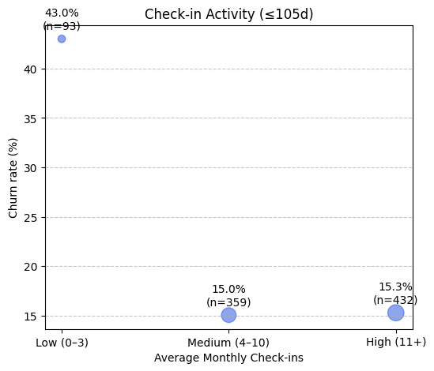
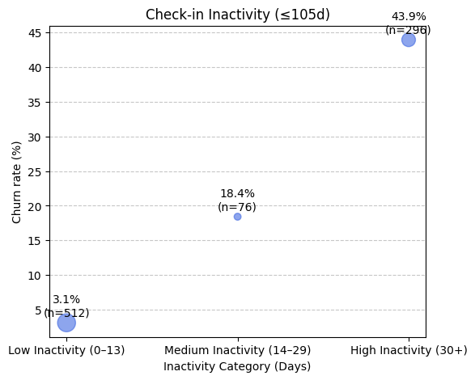

## Agreement Type & Check-in Bucket

Looking at membership type in combination with check-in frequency reveals the structural backbone of retention. Agreement terms reflect commitment, while check-in behavior reflects engagement — together, they explain why some members stay and others leave.

- **Usage drives loyalty**: Low monthly check-in users churn heavily (38–71%), while high monthly check-in users are extremely stable (3-9%).

- **Commitment matters**: Annual members churn far less than M2M in the stable (medium) monthly check-in bucket (Annual: 10%-11% vs. M2M: 19%-29%).

The heatmap shows how contract type (Annual vs. M2M) interacts with gym usage frequency (Low, Medium, High check-ins).

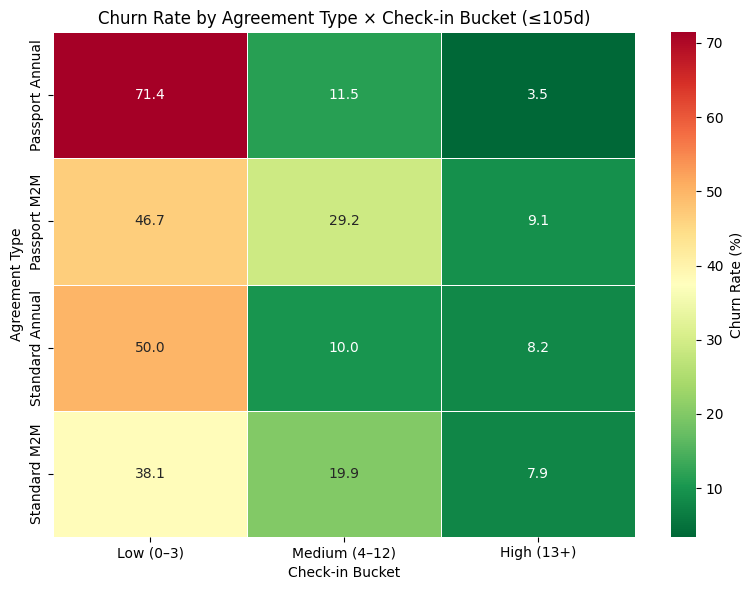

## Class Attendance & Personal Training Retention Impact

Classes and Personal Training sessions follow the same peak-hour patterns observed in overall check-ins (7–10 AM and 4–6 PM).

- **Classes boost retention**: Members who attended at least one class churn at a lower rate (17.3%) compared to those who never attended (21.3%). 

- **Personal training strengthens commitment**: Members who complete at least one PT session churn at just 12.0%, versus 19.1% for those who never participate.

- **The combo effect is strongest**: Members who do both classes and PT churn at only 11%, compared to nearly 21% for those who do neither.

Group activities like SPIN appear to be particularly effective in keeping members engaged. As for Personal Training, even minimal exposure to PT yields a meaningful improvement in member retention. These engagement activities not only increase facility use but also create social structure, community, and a sense of belonging, all of which directly reduce churn by the 105-day period.
 

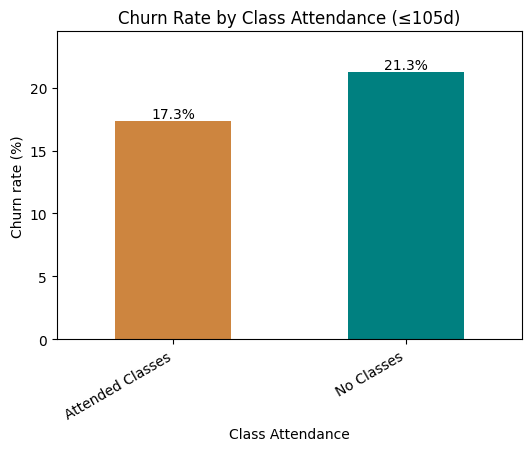
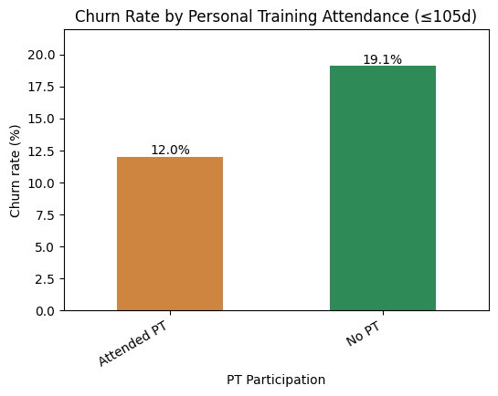
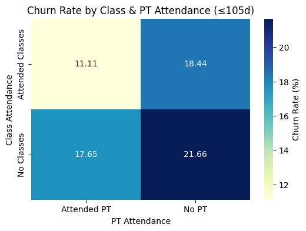

## Purchase Behavior
Purchases inside the gym — from small items like water bottles to add-ons like gear or snacks — represent more than secondary revenue.

- **Purchases signal commitment**: Members who make at least one purchase churn at just 16.9%, compared to 28.3% for those who never purchase.

This means that engaged spenders are 11.34% less likely to cancel, showing that even small transactions can reflect longer tenures.
 

## Late Payments & Retention

Payment behavior is one of the clearest early signals of member commitment. Late payments not only create operational strain but also strongly predict early dropout. 

- **Late payments are a red flag**: Members with a history of paying more than half their bills late have a churn rate of 97.5% within the first 105 days of their membership.

- **On-time payers are far more stable**: Only 12.6% of consistently on-time members cancel within the same period.

Proactively addressing payment issues through reminders, flexible plans, or check-in interventions can help recover revenue and at-risk members.
 

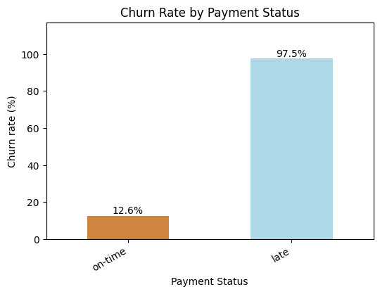

## Cancellation Reasons & External Factors

While our data indicates strong predictors of cancellations, our data also shows churned members (e.g female, 40, Standard M2M, 196 check-ins, canceled due to relocation) with strong engagement patterns. This suggests high engagement doesn’t always prevent churn and are due to external factors like relocation.

Below is the most common reasons for cancellations according to the voluntary exit survey.
 

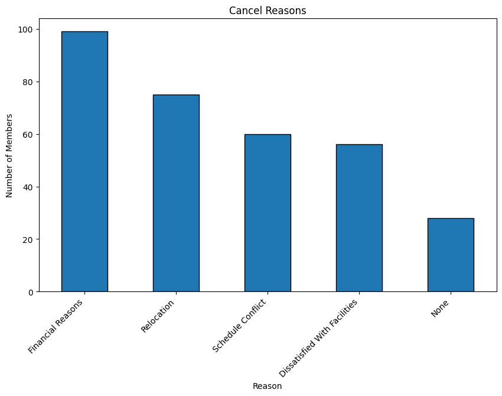

# Key Recommendations

### **Maximize Agreement Opportunities for Local Members**
Annual memberships consistently show lower churn than M2M. Encouraging longer commitments among members who are likely to remain in the area is one of the most impactful levers.

- Recommendation: Train sales staff to identify members with longer-term residency (e.g., professionals, families, or students) and emphasize the stability and savings of annual memberships.

### **Maintain a Variety of Items in the Shop**
Members who make purchases show a 11% higher retention rate than non-purchasers. By promoting small, frequent purchases, the gym can strengthen member commitment and reduce churn.

- Recommendation: Stock a diverse range of affordable and appealing items (e.g., water bottles, apparel, gear, snacks) to encourage purchases and reinforce a sense of belonging.

### **Recognize Check-In Patterns to Re-Engage Members**
Check-in frequency is a strong predictor of churn. Members who go 30+ days without visiting have a 43.94% chance of cancellation.

- Recommendation: Automatically flag members who return after 30+ days and reward them with small incentives (e.g., a free water bottle, apparel, or shop item). This creates a positive “welcome back” moment that can reignite engagement.

- Recommendation: Identify members with fewer than 9 check-ins per month (the active-member average) and reach out with personalized nudges — such as asking about schedule challenges, offering off-peak class suggestions, or extending a PT consultation.

### **Engage Members During Peak Hours**
Peak hours (7–10 AM and 4–6 PM) see the highest member activity, making them the best opportunity for direct engagement and upselling.

- Recommendation: Host free, on-the-spot fitness consultations or “mini drop-in” classes during peak hours to capture casual members who might not otherwise try structured activities.

- Recommendation: Position staff strategically during these hours to interact with members, answer questions, and build rapport.

### **Address Late Payments Proactively**
Late payments are one of the strongest churn signals: members with more than half of their payments late have a 97.5% churn rate within 105 days.

- Recommendation: Once a member has made half their payments late, escalate them to a “high-risk” category. Prioritize payment recovery and intervention (e.g., reminders, flexible payment plans, or in-person collection during check-ins).

- Recommendation: Consider introducing small incentives for on-time payments, such as loyalty points redeemable as once a year free PT session.

## Assumptions

1. It is assumed there are no restrictions on cancellations during the first month. Members are free to exit at any time without contractual penalties. This assumption explains the high early churn rates observed by day 30 and makes “first-month engagement” a critical driver of retention strategy.

2. The analysis considers only four forms of membership: Standard Annual, Passport Annual, Standard Month-to-Month (M2M), and Passport M2M No hybrid or promotional contracts (e.g., trial passes, corporate packages, or family bundles) are included in the dataset. This simplifies comparison but may understate real-world variability.

3. Payment timeliness is measured strictly as on-time vs. late, with no partial credit or grace period adjustments.

_Disclaimer: The insights in this report are based on synthetic data created for educational and demonstration purposes. They do not reflect real-world behaviors or outcomes and should not be taken as professional advice._

## Appendices

View Project Here: https://tony-gh123.github.io/Data-Wrangling-Python-SQL-Churn-Data-Analysis/  
View Portfolio Here: https://tony-gh123.github.io/yeral.github.io/ 

